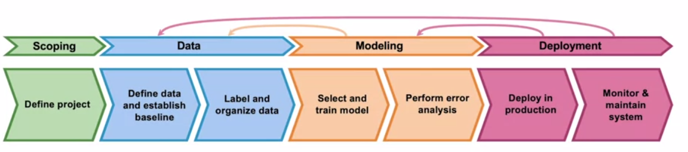
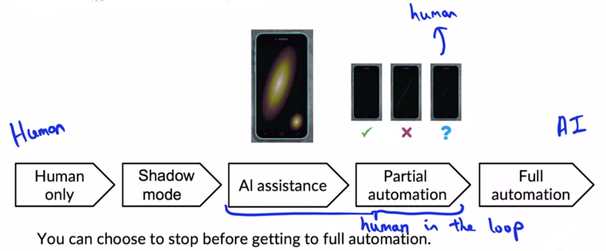
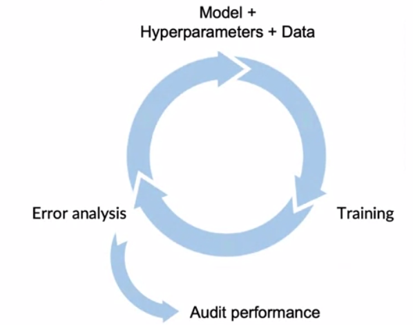

# Introduction to Machine Learning in Production

This course first explains a machine learning project lifecycle (see picture above). It then discusses the individual stages from end to beginning

- Deployment & monitoring in week 1
- Model selection and modeling & error analysis in week 2
- Data definition & data organization & scoping in week 3

## Key lessons learned

### There are many stages of AI

> Instead of thinking of deployment as on/off rather think of *Degrees of automation*:

### Quickly enter the iterative cycle

**Quickly** enter the **iterative** cycle consisting of training, error analysis and changing model, data and hyperparameters

- Modeling
  - 0.5 days of literature research (no need to get the latest algorithm, rather something robust).
  - Use open-source implementations as baslines (use baselines at all!).
  - Consider deployment options only after you know that a model is technically feasible.
  - Sanity check your model: First overfit on one item, then on ~100, then further.
- Data gathering
  - Most teams spent too much time on **initial** data gathering. Two days sounds reasonable.
  - After that, increase your data by at most 10x in each iteration (1.2x = 20% would also be fine!).

### Labeling

- It's a good idea to make ML engineers label the data for ~2 days to
  - get an understanding of the data
  - refine the labeling instructions to get consistent labels
- Starting around 10.000 items you cannot review each item and need some tools.

### Data-centric AI development 

- Academia often fixes the data and modifies the model.
- For most projects it makes more sense to fix model and modify data and labels.

### Scoping

Always start with business problems and **later** ask how AI might mitigate those. Assess proposals  based on feasibility and impact.