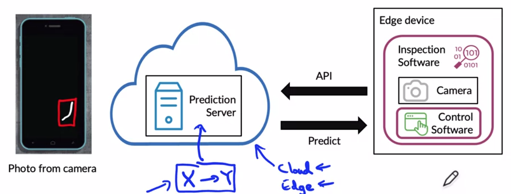
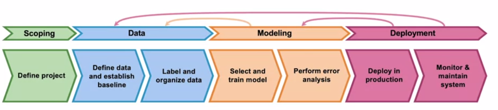
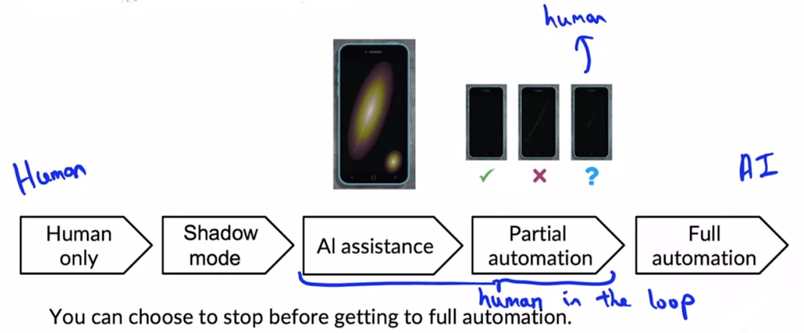

# Week 1: Overview of the ML Lifecycle and Deployment

## The Machine Learning Project Lifecycle

The following deployment example is described. Data drift may occur if actual photos are much darker than the ones in training and test set.

### ML project lifecycle

The lifecycle is described using the diagram below and uses the example of a speech recognition project:

- Data
  - How do you want to label data? (E.g. "Umm, today's weather" or "Um... today's weather" or "Toda's weather")
  - How much silence before/after each clip? How much volume normalization?
- Modeling
  - In research projects, often data is fixed and model, hyperparameters are varied.
  - In product teams, often code is fixed and data, hyperparameters are varied.
- Deployment
  - Example: speech recognition model was trained on adult voices, but received lots of young voices ("data drift"). How to detect and quickly fix this?

The next weeks focus on those three stages:

- week 1: deployment
- week 2: modeling
- week 3: data

## Deployment

### Key challenges

- Concept drift and data drift
  - Data drift = change in data
  - Concept drift = Relation between input and output data changes
    - e.g. relation between purchasing patterns and anti-fraud due to COVID
    - e.g. relation between house size and house price due to house market crisis
  - Can be gradual change (e.g. new words in English language) or sudden change (e.g. COVID-effect suddenly changed purchasing patterns)
- Software engineering issues
  - Realtime or batch (e.g. overnight)
  - cloud vs edge -> compute resources !
  - latency, throughput in queries per second (QPS)
  - Logging
  - Security and Privacy

### Deployment patterns

The deployment pattern may depend on the use case

| Use case                                          | Deployment pattern                                           |
| ------------------------------------------------- | ------------------------------------------------------------ |
| New product or capability                         | start out something small and gradually scale it up          |
| Automation (or assisting) an existing manual task | Start with a *shadow deployment* (i.e. predict, but hide results), later use *canary deployment* (i.e. roll out to 5%) |
| Replacement a previous ML system                  | gradually ramp up with the possibilty of a rollback. To this end, use a *blue/green deployment* (i.e. insert a router which forwards to either the old blue model or the new green model) . |

> Note: "canary deployment" allows you to spot problems similarly to a "canary in a coal mine" spotting gas leaks. 

Instead of thinking of deployment as on/off rather think of *Degrees of automation*:

### Monitoring

Some examples of which metrics to monitor (although it is a very iterative process!)

| Category         | Example metric                                               |
| ---------------- | ------------------------------------------------------------ |
| System health    | server load, memory, compute, latency, throughput            |
| Input data       | average input length in minutes / brightness, fraction of missing values |
| Predictions      | fraction of NULL values, average output length in characters |
| User interaction | number of retries, number of correcting prediction output    |

When some metrics drop below the required threshold, one may

- manually retrain the model (more common nowadays)
- automatic retrain the model

### Pipeline monitoring

Many ML systems are actually not just a single model, but rather a pipeline with several steps. Two examples:

- speech --> Voice activity detection --> model for text --> text
- user clicks --> model for user profile (e.g. does user own a car) --> model for recommendations --> product recommendation

For such pipelines, it is helpful to measure the above metrics **for each component of the pipeline**.

## Lab

The [lab](https://github.com/https-deeplearning-ai/machine-learning-engineering-for-production-public/tree/main/course1/week1-ungraded-lab) consists of 

- `server.ipynb`
  - using the YOLOv3 object detection model
  - writing a prediction API using FastAPI
  - starting a local server
  - trying out the API using the automatically published swagger documentation from FastAPI
- `client.ipynb`
  - sending a request to the local server on `http://localhost:8000`
  - displaying the result

The lab is optional and since I've already worked with FastAPI, I'm not repeating the steps.