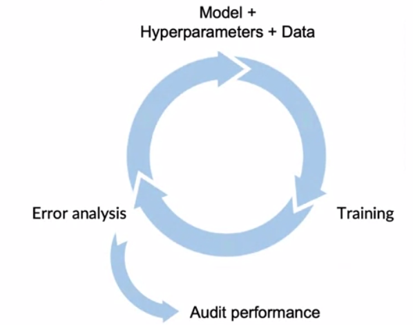
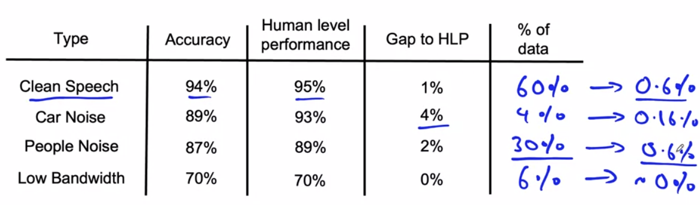

# Week 2

This week will focus on the Modeling part in the ML project lifecycle. 

## Selecting and Training a Model

AI system = code + data (+ hyperparameters, but limited variety and even influence?). During its development, one can focus on either area:

- model-centric AI development --> usual focus in research
- data-centric AI development --> often more useful for real projects
  - = Not just use more data, but how to improve data in the most efficient way

### Key challenges

There are in general three milestones

1. Doing well in training set
2. Doing well in test set (e.g. low average error)
3. Doing well according to business metrics (project goals)

### Why low *average* test error isn't good enough

- poor performance on rare example
- poor performance on key slices of data set (i.e. one ethnicity in loan approval or small retailers in product recommendations)
- rare classes or skewed data distribution -> do not use accuracy, rather f1-score.
  - Example: rare condition in lung chest xrays -> error not acceptable even if small effect on average test error

### Establish a baseline

How to establish a baseline

- human level performance (HLP) - great for unstructured data as maximum achievable performance (image, audio, text), less useful for structured data (tabular database)
- literature research for state-of-the-art / open source
- quick and dirty implementation
- performance of older system

### Tips for starting ML project

How to efficiently start the first iteration (model+hyperparameters+data)

- 0.5 days of literature research (courses, blogs, open-source projects). No need to get the latest algorithm, rather something reasonable providing a quick start.

  - > A reasonable algorithm with good data often outperforms a great algorithm with not so good data.

- Find open-source implementations if possible for a baseline

- Consider deployment constraints only after you know project likely works (e.g. **after** baseline!)

- Sanity-check code and algorithm

  - Overfit on **one** item
  - Train on ~100 items

## Error analysis and performance auditing

Example

- Determine under which conditions speech recognition model fails, e.g. given car noise, given people noice, given low bandwidth. Can be done using a spreadsheet or MLOps tools like [LandingLens](https://landing.ai/platform/).
- Tag data
- Correlate errors with tag

### Prioritizing what to work on

How to improve upon errors

- collect more data
- use data augmentation
- improve label quality

### Skewed datasets

Instead of accuracy, use precision / recall or F1score: $F_1 = \frac{2}{1/P + 1/R}$. In multi-class metrics, one can compute F1-score for every class.

### Audit performance

General workflow

- Brainstorm the ways the system might go wrong (e.g. performance on subsets, rare classes)
- Establish metrics against these potential issues (maybe using [TensorFlow Model Analysis](https://www.tensorflow.org/tfx/tutorials/model_analysis/tfma_basic))

## Data iteration

- Again, focus on data-centric AI development
- Getting **more** data for a subset category (e.g. speech with cafe noise) will in general improve performance also on similar subset categories (e.g. speech with library noise)

### Data augmentation

= create examples which...

- are realistic
- the current algorithm struggles with
- humans (or another maximum baseline) can still solve well! Check this manually!

Adding data rarely [hurts performance](http://arxiv.org/abs/1912.02292), only if...

- model is too small
- new examples are ambiguous (e.g. I can be "i" or "1")

For structured data, it may be difficult to easily add / synthesize new data (?). Instead, you can add new features. Examples:

- For a restaurant recommender system: probability of user being vegetarian
- For food delivery recommender system: Only tea / only pizza
  - Collaborative filtering - based on similarity of user. However, may have "cold start" problem for new products!
  - Content based filtering - does not take similar user into account.

### Experiment tracking

Track ...

- code
- dataset
- hyperparamters
- results

There are different tracking tools (MLFlow, Amazon SageMaker, ...) which offer desirable features

- information needed to replicate results
- experiment results, ideally with summary
- resource monitoring
- model error analysis

### Shift from big data to good data

Good data = 

- covers important cases (coverage of `x`)
- has unambiguous and consistent labels
- has timely feedback from production (e.g. data drift and concept drift)
- is sized appropriately (?)

## Optional Lab

Using a google [colab notebook](https://colab.research.google.com/github/https-deeplearning-ai/MLEP-public/blob/main/course1/week2-ungraded-lab/C1W2_Ungraded_Lab_Birds_Cats_Dogs.ipynb)...

- Manually move images around the filesystem so they are stored in a structure suitable for model training.
- Clean up the dataset as it presents some corrupted images and other issues.
- See how class imbalance negatively affects model evaluation.
- Solve overfitting problems by using Data Augmentation techniques.