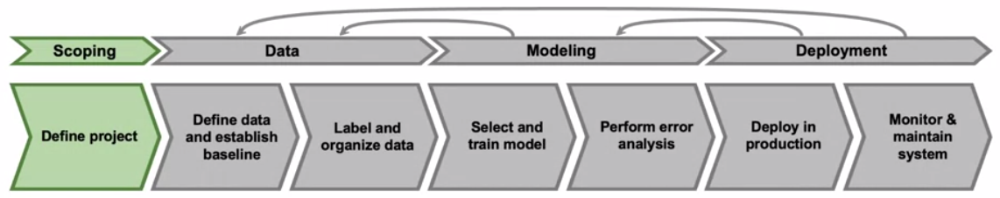

# Week 3

## Define data and establish a baseline

### Label ambiguity

Defining how to label may be difficult due to ambiguity:

- Example: speech recognition
  - "Umm... nearest gas station"
  - "um, nearest gas station"
  - "Nearest gas station [inaudible]"
- Example: object detection in image classification, see below

Answer those questions when defining data / labels:

- What is the input?
  - What are requirements on input quality (noise, lighting, resolution, ...)
  - What features are required
- What is the target label?
  - How can we ensure consistent labels?

### Types of data problems

> 10,000 examples = big data because at this point difficult to examine each example

- "emphasis on data processes" = good data collection, filtering, processing, labeling processes
- experience in the same quadrant is key!

### Small data

A lot of focus and company use cases have been on big data. However, small data is also possible!

- In this case, it is very important that labels are clean
- small data can also occur in big data in the sense of rare classes / rare events (think autonomous cars)

### Improving label consistency

- label example multiple times (by different labelers or even same labeler after a time) <-- however, overused in his opinion. Rather focus on making inambiguous label guidelines and use this strategy as a last resort
- in case of disagreements, reach agreement via MLE or expert
- reconsider required quality of input data (maybe discard some examples)
- capture uncertainty via an "uncertain class" (e.g. true / false /  uncertain) or "[unintelligible]"

### Human level performance (HLP)

- used to estimate a maximum performance
- Warning: If ground truth label is defined by a human, then HLP rather represents agreement between two humans! 
- Warning:  Don't easily say "ML system is superior to humans"! Potential reasons for that:
  - algorithm simply more in agreement with (human) ground truth labeler
  - ambiguous labels, where algorithm tends to the "favored" decision. This would lead to a better accuracy, but is irrelevant for the business case!
  - In such cases, rather try to raise HLP via label consistency through more consistent guidelines

### Raising HLP

>  When the ground truth is labeled from a human, HLP << 100% may indicate ambiguous labeling instructions.

## Label and organize data

### Obtaining data efficiently

How long should you spend obtaining data?

> "Rarely met teams where too littĺe time was spent on **initial** data collection. Most invest too much".

> "Increase your data by at most 10x at a time. Even okay to increase by 10-20% and see effect."

Be creative where you can get data from and compare options!

General tips on how to label

- label sources
  - in-house
  - out-sourced
  - crowd-sourced
- Having Machine Learning Engineers label data is expensive, but often fine for a few days. It has important advantages:
  - get some intuition about data quality, distribution, examples
  - refine labeling instructions

### Data pipelines

- Make sure that pre-processing is replicable! (May be skipped if necessary in the POC-phase, but take extensive notes / comments)
- For production use tools such as TensorFlow Transform, Apache Beam, Airflow, ...

### Meta-data, data provenance and lineage

Definitions

- data provenance = where input data comes from
- lineage = sequence of steps (to get to end of pipeline)

In the example above, if we change the original spam dataset, do we also need to change all downstream models?

- There are tools like TensorFlow Transform to help, but most are still rather immature
- Best strategy at the moment is to keep a lot of metadata! Metadata is useful for...
  - keeping track of data provenance
  - error analysis as well!

### Balanced train/dev/test set

- Instead of randomly splitting dataset, split it in a balanced way (such that percentage of classes is equally distributed). 
- This is mostly important for data sets, as in big data set random split is often balanced anyhow.

## Scoping

### What is scoping

Example: e-commerce retailer looks to increase sales and has several possible projects to do this:

- better recommender system
- better search
- improve catalog data
- optimize price

How to compare these options?

- what are the metrics for success?
- what are the resources (data, time, people) needed?

### Scoping process

| business problem    | potential solution                                         |
| ------------------- | ---------------------------------------------------------- |
| increase conversion | search, recommendations, ...                               |
| reduce inventory    | demand prediction, marketing for "idle" stuff in warehouse |
| increase margin     | optimize what to sell, recommend bundles                   |

### Diligence

To assess technical feasibility...

- use external benchmark such as literature, other companies, etc.
- for unstructured problems, use HLP
- for structured problems, are predictive features available? (In case of an existing project, are *new* predictive features available?). In other words, sometimes data is simply not very predictive:
  - given DNA, predict heart disease probability
  - given social media, predict next fashion trend in 6 months
- For any existing solution, look at history of that solution
  - For example, if error between algorithm and HLP decreases every quarter, predict error of next quarter in the sense of $residualError(t+1)~=\eta \cdot residualError(t)$

To asses value use different metrics which range from close to Machine Learning Engineer (MLE) to Business metrics:

It is also helpful to do back-of-the-envelope estimations ("[Fermi estimates](https://en.wikipedia.org/wiki/Fermi_problem)") of how one metric relates to another (e.g. increasing word-level accuracy by 1% leads to a 0.7% increase in query-level accuracy).

To assess ethical considerations:

- is this project creating a net positive societal value?
- is this project fair and free from bias?
- have any ethical concerns been raised?

### Milestones

Key specifications

- ML metrics (accuracy, precision / recall, ...)
- software metrics (latency, throughput, ...)
- business metrics (revenue, ...)
- resources needed (data, personnel, ..)
- timeline

## Lab

[Jupyter notebook](https://www.coursera.org/learn/introduction-to-machine-learning-in-production/ungradedLab/hnDmK/data-labeling/lab?path=%2Fnotebooks%2FC1W3_Data_Labeling_Ungraded_Lab.ipynb) hosted on coursera which uses different labels, trains model on those labels (Ngram + CountVectorizer + NaiveBayes) and evaluates model. As dataset, 2000 comments to popular youtube videos are used with columns (text, author, date). The model identifies whether the comment is spam.

The following labeling strategies are tested:

- random labels as lower bound yielding 40-60% accuracy
- true labels as upper bound yielding 92% accuracy
- automatically generated labels using different strategies
  - spam if text contains `free `, `subs`, `http` yielding ~50%
  - & not spam if text contains  `view `, `song ` yielding ~70%
  - & not spam if average text is less than 30 character yielding ~85%

