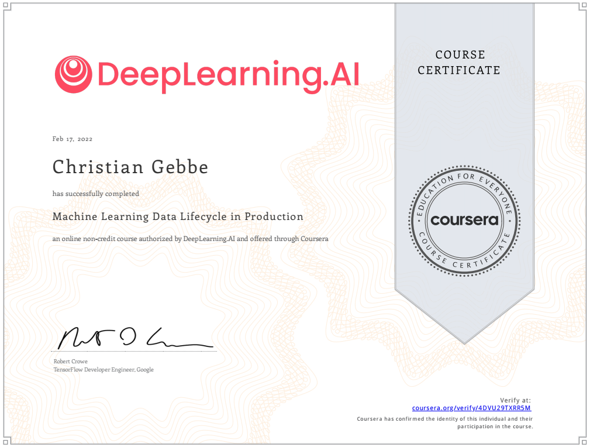

# Machine Learning Data Lifecycle in Production

- week 1: Collecting, Labeling and Validating Data
- week 2: Feature Engineering, Transformation and Selection
- week 3: Data Journey and Data Storage
- week 4 (optional): Advanced Labeling, Augmentation and Preprocessing

### Certificate

