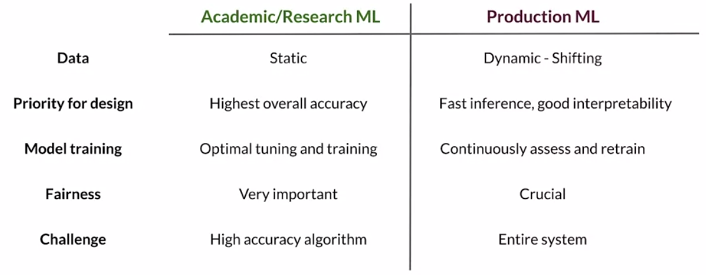
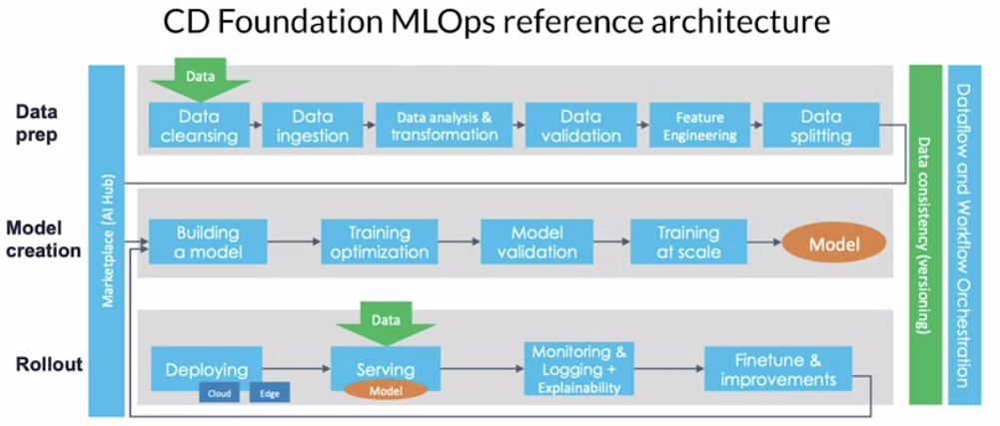
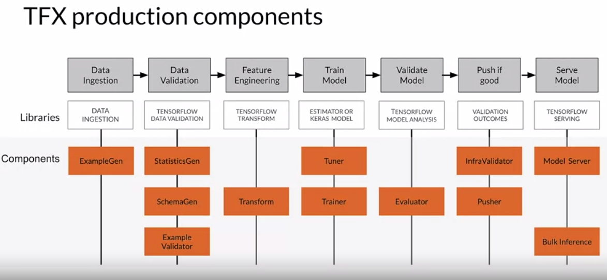
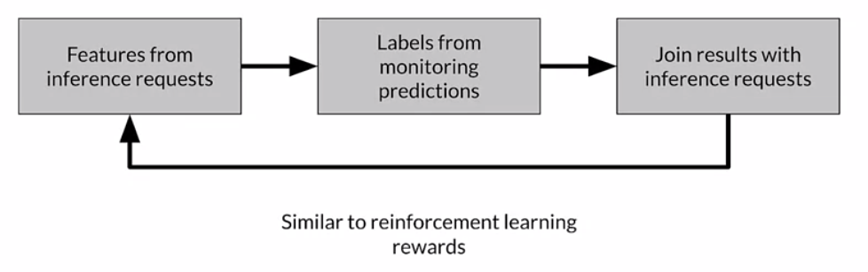
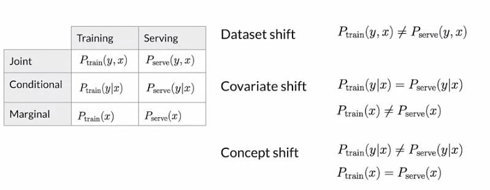
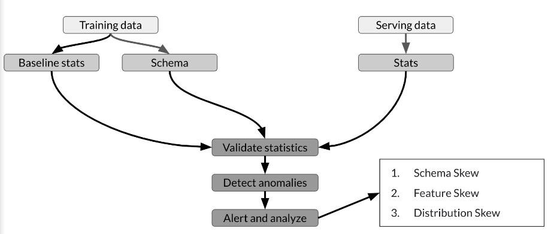

# Week 1

## Introduction

> Broken data is the most common cause of problems in production ML systems

### Differences between research ML and production ML

Challenges in production ML

- Build integrated system (not just a model)
- Continuous operation
- Continuously changing data
- Optimize compute resource costs

### ML pipelines

ML pipelines...

- are at the art of every ML system
- usually take the form of a directed acyclic graph (DAG), although rare examples can contain cycles
- can be implemented using e.g. Airflow, Argo, Celery, Kubeflow, TensorFlow Extended (TFX)

[TensorFlow Extended](https://www.tensorflow.org/tfx/guide) (TFX)...

- is a toolkit for building pipelines and pipeline components.
- pipeline can run on several platforms such as [Airflow](https://www.tensorflow.org/tfx/tutorials/tfx/airflow_workshop), Kubeflow, Apache Beam
  - for each of the platforms, it implements a TFX Runner, e.g. an [Airflow TFX Runner](https://github.com/tensorflow/tfx/blob/efd32fd3552a7aa7484ef11c4fc43ce5cb34a5c5/tfx/orchestration/airflow/airflow_dag_runner.py#L52)
- is open-source

Description of some components:

- ExampleGen = generate examples from dataset (ingests data)
- StatisticsGen = generate statistics for data
- ExampleValidator = validates data - used to look for problems in data
- SchemaGen = generate schema for data "across" feature vector 
- Transform = generates features
- Tuner = tunes hyperparameters
- Trainer = train model
- Evaluator = evaluates model performance "deeply"
- InfraValidator = validate that model can run on infrastructure
- Publisher = publishes model to e.g.
  - TensorFlowHub (similar to github?)
  - TensorFlow JS for nodejs application such as web browser
  - TensorFlow LIte for mobile application or IOT device
  - TensorFlow Serving for server cluster

## Collecting Data

### Importance of data

Example of creating a model to predict amount of time to get through airport security. Data collection was very painful due to a lot of manual effort and security restrictions. 

Data not only occurs during collection, but also during labeling, feature engineering and final monitoring.

### Example application: Suggesting runs

> Note: This video seemed rather like a story telling than an outline of how to proceed...

Goal: Model which suggests certain routes to runners (at certain times). Key considerations are:

- Key considerations:
- how to translate user needs into data needs
- data availability (what data is available, how to get labels?)
  - labels = user feedback in form of 
    - acceptance of suggestion
    - rating of recommended run
    - reason for rejection
- Check data consistency (formatting, values)
- Feature engineering maximizes predictive signal
  - runner demographic, time of day, pace, distance, elevation
- Feature selection helps measuring the predictive signal
- Monitor outliers and errors

### Responsible data: Security, Privacy and Fairness

> Note: Again, not a real outline identifiable?

Example: African wedding dress not recognized as such, but all "western" wedding dresses.

Strike a balance between Fair, Accountable, Transparent, Explainable.

Commit to fairness by ... ?!

"representational harm" = amplification of bias by model

## Labeling Data

### Case study: Degraded Model Performance

Example: Model that predicts click-through rates (CTR) for an online shoe retailer to determine how much inventory to order. Suddenly, prediction accuracy has dropped for mens shoes. Why?

- How to detect problems early on?
- What are possible causes? (e.g. change in season, style, competition, new geography, ...)
- What are adequate solutions?

### Data and concept change 

Can change slow or fast

### Process feedback and human labeling

labeling methods:

- process feedback (direct labeling)
  - Example: Did user click on link you recommended?
  - allows a feedback loop ("data flywheel")
  - useful tools: [Logstash](https://www.elastic.co/logstash/) or [fluentd](https://www.fluentd.org/) or cloud logging tools such as google cloud logging or AWS ElasticSearch or Azure Monitor
- human labeling
  - Example: Doctor labels MRI image
- semi-supervised  labeling
- active learning
- weak supervision

## Validating Data

### Detecting data issues

> Honestly, difference between terms still not exactly clear. The quiz differentiates hard between feature skew and distribution skew, but this distinction has not been made that clearly in the presentations.

- "drift" = changes in data *over time*
- "concept drift" = change of mapping between data and labels *over time* 
- "skew" = changes between two *static* data versions
  - schema skew = training and serving data do not conform to the same schema (e.g. string instead of integer)
  - distribution skew = divergence of distribution

- "model decay" = model performs poorly *over time*, e.g. due to data drif

**Distribution skew** can manifest itself in the form of dataset shift, covariate shift or concept shift:

### TensorFlow Data Validation (TFDV)

TFDV...

- is a library to validate and monitor ML data at scale (think Petabytes). To achieve scaling it uses [Apache Beam](https://beam.apache.org/).
- generates data statistics and browser visualizations
- infers the data schema
- performs validity check against the schema
- detects training/serving skew
  - schema skew (int!=float)
  - feature skew (difference in feature values measured via the Linfty distance $d=\max_i|x_i-y_i|$)
  - distribution skew (see above)  

## Lab (optional)

Create a small TFDV pipeline. As dataset, it uses the [census income dataset](http://archive.ics.uci.edu/ml/datasets/Census+Income). The model shall predict whether an individual earns more than 50k USD annually based on occupation, education, sex, age, etc.

- split dataset into train and eval
- for train set
  - generate statistics via `tfdv.generate_statistics_from_dataframe(train_df)`
  - visualize statistics via `tfdv.visualize_statistics(train_stats)` to show...
    - for numerical features: count, percentage of missing values, number of zeros, mean, std, min, max, median, distribution ...
    - for categorical features: count, percentage of missing values, unique values, distribution, ... 
  - infer schema (dtype, required / optional) via `tfdv.infer_schema(statistics=train_stats)`
- for eval set
  - add malformed rows to eval dataset (e.g. `Mongolia` for `native-country ` )
  - drop some rows (whose age < 16 or age > 91)
  - generate statistics
- Detect anomalies
  - detect anomalies via `anomalies=tfdv.validate_statistics(statistics=eval_stats, schema=schema, environment=None)`. It detects that for some features, new values were added, e.g. `Mongolia` for `native-country`. However, these values occur rarely (<1%) and seem to be expected.
  - Fix the anomalies by either allowing new rare values or adding the new values to the schema explicitly. One can also define environments for train / test (since label column will be certainly missing in test environment).
  - --> Only some of the anomalies from above are detected?
- Examine dataset slices
  - Instead of visualizing one dataset statistic, directly compare two via `tfdv.visualize_statistics(lhs_statistics=..., rhs_statistics=...)`

### Lab (mandatory)

- uses a hospital dataset with the label column "readmitted"=[True,False]
- Jupyter notebook, where we will effectively repeat the steps above to a new dataset with unknown anomalies. In addition, we will...
  - check for data drift and skew using `tfdv.validate_statistics(train_stats, schema, previous_statistics=eval_stats, serving_statistics=serving_stats)`.

- To grade only certain code, insert an `# grade-up-to-here` comment in cells starting with `### START CODE HERE`
- sidenote: Use `pandas` `describe()` method