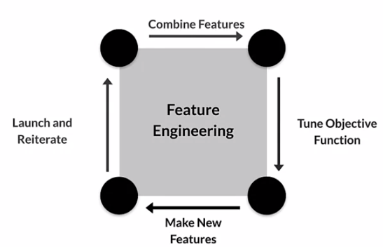
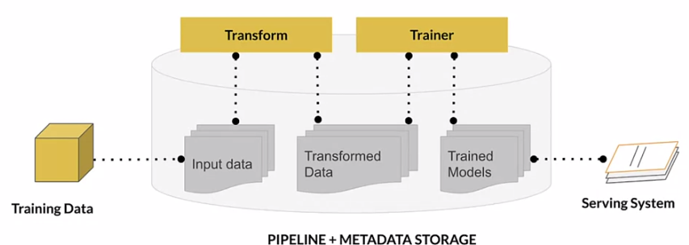
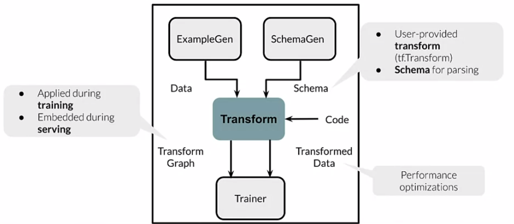
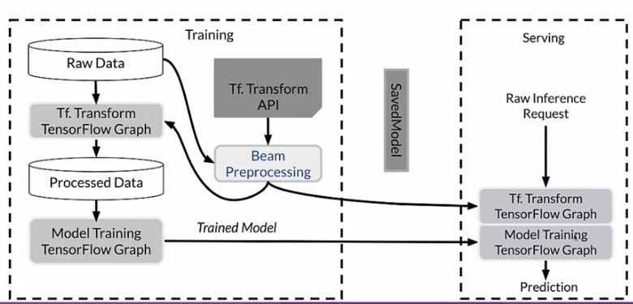
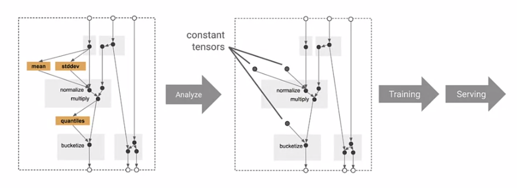
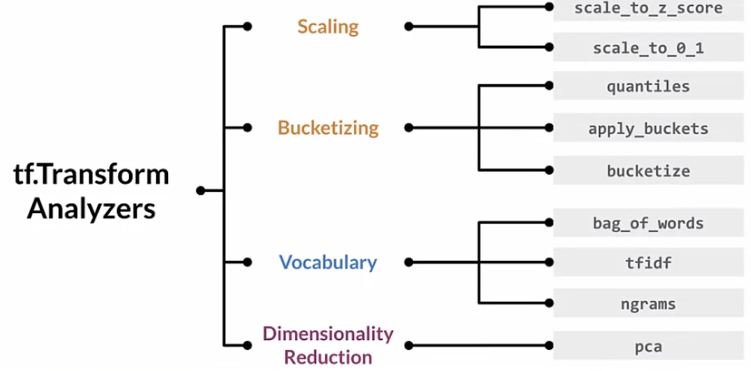
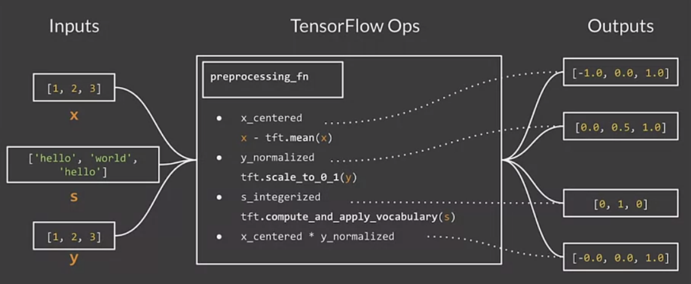
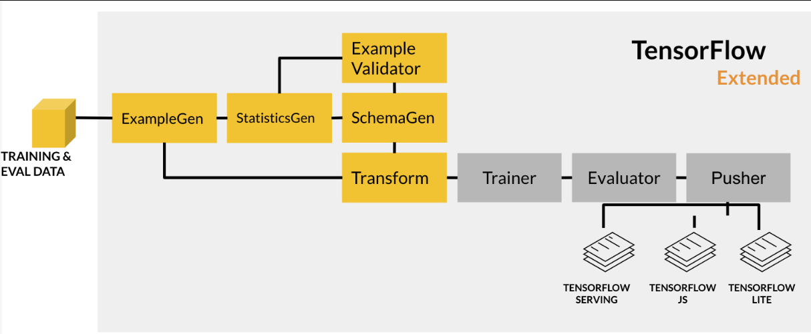
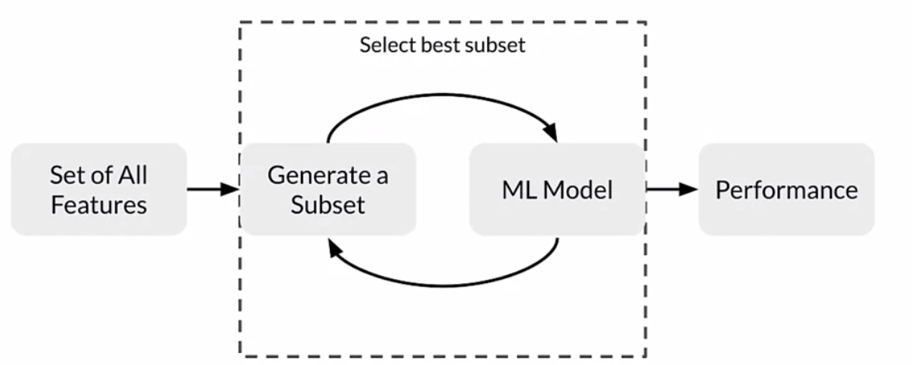

# Week 2: Feature Engineering, Transformation and Selection

## Feature Engineering

### Introduction to Preprocessing

Feature engineering is a again an iterative process:



Challenge of production-level feature engineering: Cannot easily compute "global" values such as std of feature column. In other words, limited to batch operations?!

### Preprocessing Operations

> Again, no clear outline visible :/

- Data cleansing
- Feature tuning (scaling, normalizing)
- Representation transformation
- Feature extraction (e.g. dimensionality reduction)
- Feature construction (create new features)

### Feature engineering

- Standardization using z-score or binning (with [google facets](https://pair-code.github.io/facets/))
- Encoding of categorical values
- Dimensionality reduction, which you can nicely visualize using [TensorFlow embedding projector](https://projector.tensorflow.org/)

### Feature crosses

feature crosses...

- = combine multiple features into a new feature
- can encode nonlinearity in feature space (e.g. A*B)

## Feature Transformation

### Preprocessing at scale

- when doing feature engineering, start out with a small data subset and then consider whether you need to change anything when using the whole dataset
- Use the same kind of processing pipeline during experimentation as in production
- Use exactly the same transformations during training and serving

There are some things which only work using the full-dataset (full-pass vs. instance-level):

- min-max - Alternatively, clip with fixed numbers
- standard scaling - Alternatively, multiply with fixed numbers
- bucketizing - Alternatively, expand features (?)

Instead of transforming per full dataset, you can also transform per batch (e.g. normalizing). Has again some pros and cons...

When to transform?

- preprocess entire training dataset (has some pros, but slow iterations)
- preprocess on the fly "within the model" (faster iterations but longer compute time for model)

### TensorFlow Transform (TFT)

TFT not only transforms data, but also tracks metadata (see image below)



TFT....

- receives as input...
  - data from the "ExampleGen" Pipeline component
  - data schema from the "SchemaGen" Pipeline component
  - user code
- outputs to the "Trainer" Pipeline component...
  - transformed data
  - transform TensorFlow Graph (which will then be embedded into the trainer?) 



TFT behaves differently during training and serving



### TFT Analyzers

tf.Transform Analyzers (for example `tft.min`)...
- behave like usual TF Ops
- run only **once** during training and are then being converted to constant tensors



Some examples of TFT analyzers



### Hello world with TFT

Define raw data and raw metadata
```python
from tensorflow_transform import tf_metdata as tfm

raw_data = [
    {'x': 1, 'y': 1, 's':'hello'},
    {'x': 2, 'y': 2, 's':'world'},
    {'x': 3, 'y': 3, 's':'hello'},
]
schema=tfm.dataset_schema.from_feature_spec({
    'y': tf.io.FixedLenFeature([], tf.float32),
    'x': tf.io.FixedLenFeature([], tf.float32),
    's': tf.io.FixedLenFeature([], tf.string),
})
raw_metadata = tfm.dataset_metadata.DatasetMetadata(schema)
```

Define preprocessing function which receives item as dictionary and outputs a separate dictionary. It uses `tft.scale_to_0_1`, `tft.compute_and_apply_vocabulary`, ...



Define a main.py
```python
with tft_beam.Context(temp_dir=tempfile.mkdtemp()):
	transformed_dataset, transform_fn = (
		(raw_data, raw_data_metadata) |
		tft_beam.AnalyzeAndTransformDataset(preprocesing_fn)
	)
    transformed_data, transformed_metadata = transformed_dataset
```


### Simple Feature Engineering

This [jupyter notebook](https://www.coursera.org/learn/machine-learning-data-lifecycle-in-production/ungradedLab/HBocn/simple-feature-engineering/lab?path=%2Fnotebooks%2FC2_W2_Lab_1_Simple_Feature_Engineering.ipynb) shows the hello world example above.

### Feature Engineering

This [jupyter notebook](https://www.coursera.org/learn/machine-learning-data-lifecycle-in-production/ungradedLab/z0oUL/feature-engineering-pipeline/lab?path=%2Fnotebooks%2FC2_W2_Lab_2_Feature_Engineering_Pipeline.ipynb) show TensorFlow transform in the context of an ML pipeline (see below). As dataset, it uses the censor income dataset.



```python
# setup, run and extract output from one TFX component
example_gen = tfx.components.CsvExampleGen(input_base=_data_root)
context = InteractiveContext(pipeline_root=_pipeline_root)  # from tfx
context.run(example_gen)
output = example_gen.outputs['examples'].get()

# to *visualize* output
context.show(statistics_gen.outputs['statistics'])

# define transform component using the existing inputs

# Instantiate the Transform component
transform = tfx.components.Transform(
    examples=example_gen.outputs['examples'],
    schema=schema_gen.outputs['schema'],
    module_file=os.path.abspath(_census_transform_module_file))
)

# Extract the transformed output
train_uri = os.path.join(transform.outputs['transformed_examples'].get()[0].uri, 'Split-train')
tfrecord_filenames = [os.path.join(train_uri, name) for name in os.listdir(train_uri)]
transformed_dataset = tf.data.TFRecordDataset(tfrecord_filenames, compression_type="GZIP")
sample_records_xf = get_records(transformed_dataset, 3)
pp.pprint(sample_records_xf)
```

##  Feature Selection

### Feature spaces

duh...

### Feature selection

Goal is to identify *useful* features and thereby reduce *feature space*. This is beneficial for..

- a reduced size of model and input data  -> faster compute time, lower training and inference costs
- better explainability

There are two ways to select useful features:

- unsupervised selection removes redundant features by correlation
- supervised selection selects those features which contribute most
  - filter methods
  - wrapper methods
  - embedded methods

### Filter methods

Can be further split up in

- correlation <-- primarily used
  - Use Pearson Correlation between features and the label (between features would be unsupervised)
- univariate feature selection <-- more rarely used, mainly for efficiency

Correlation method ...

- measure the correlation between the features and the label (correlation between features would be unsupervised)
- uses as statistical indicators
  - Pearson Correlation Coefficient for linear relationships
  - Kendall Tau Rank Correlation Coefficient for monotonic relationships and small sample size
  - Spearman's Rank Correlation Coefficient for monotonic relationships
- uses the following statistical tests
  - Mutual information
  - F-Test
  - Chi-Squared tests
- simply removes all features with `|corr|<0.2`. 
- is implemented in SKLearn, which provides..
  - the following feature selection routines
    - `SelectKBest`
    - `SelectPercentile`
    - `GenericUnivariateSelect`
  - the following statistical tests
    - `f_regression`, `mutual_info_regression` for regression
    - `chi2`, `f_classif`, `mutual_info_classif` for classification

#### Wrapper methods

can be further split up in...

- forward selection
- backward selection
- recursive feature elimination

Forward selection...

- is an iterative, greedy method 
- starts with 0 features.
- in each iteration, adds one more feature
- evaluates model performance when adding each of the additional features
- stop when no more improvement

Backward selection works the same way, but starts with all features and then iteratively removes one.

Recursive feature elimination (RFE) works similar to backward selection, but discards features by feature importance instead of model performance. Usually stops at a predefined number of features. This technique can only be applied to models which enable deriving feature importance!



### Embedded methods

embedded methods...

- can be further split up in...
  - L1 regularization
  - feature importance
- really depend on the model being used
- work by...
  - assigning scores for each feature
  - discarding features by *feature importance*
  - In the example, uses
    -  `model = sklearn.RandomForestClassifier().fit()`
    - `slim_model = sklearn.feature_selection.SelectFromModel(model, ...)` which inherently uses `model.feature_importances_`

### Jupyter notebook example

same code examples as beforehand...

## Lab 

As dataset, it uses the [Metro Interstate Traffic Volume Data Set](https://archive.ics.uci.edu/ml/datasets/Metro+Interstate+Traffic+Volume). Goal is to predict traffic volume for specific hour. It very closely follows the jupyter notebook above concerning the use of TFX components.

- Uses `%% writefile` to write to file in jupyter notebook