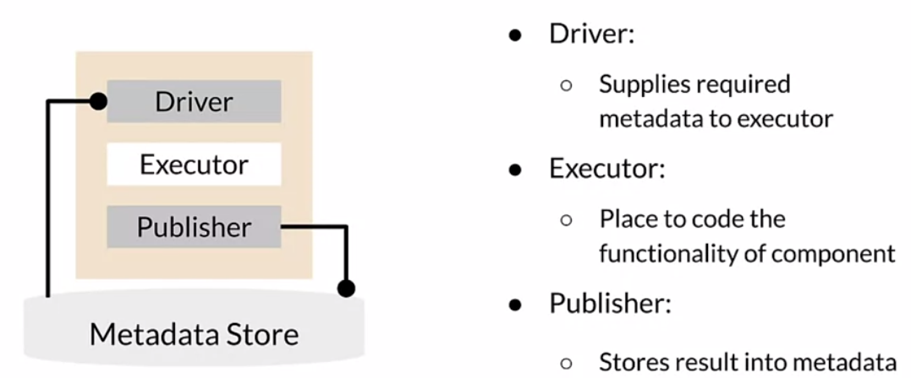
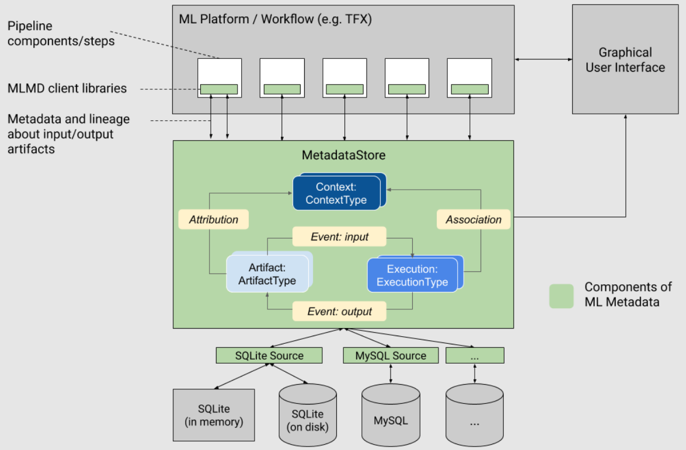
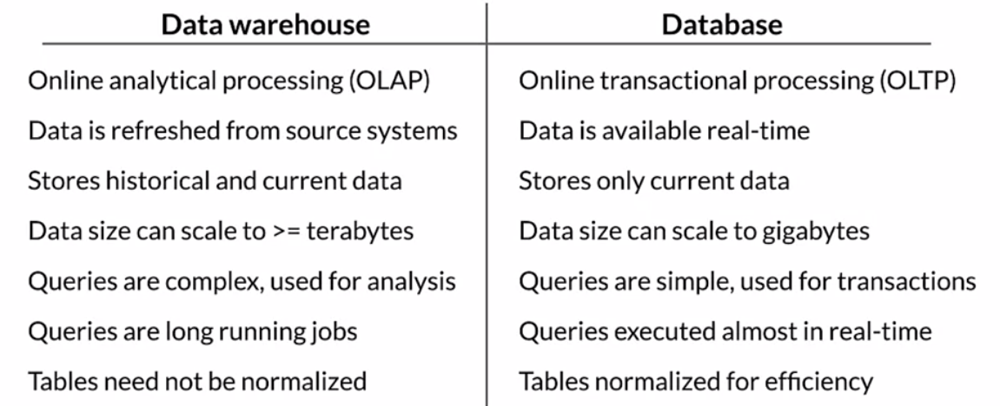
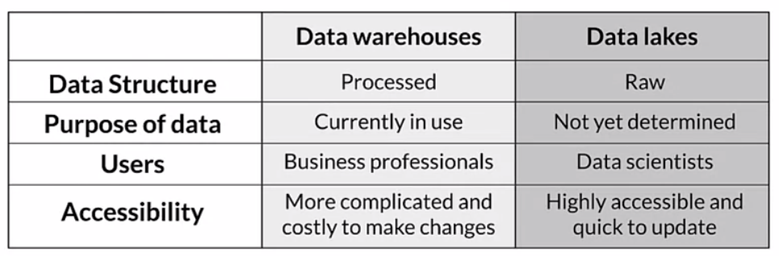

# Week 3: Data Journey and Data Storage

## Data Journey and Data Storage

Data lineage..

- is used as a synonym with data provenance?
- helps with debugging and comparing training runs
- may be necessary for regulatory compliance

Ensure reproducability by versioning...

- environment through Docker, [Terraform](https://www.terraform.io/)
- code through e.g. Github
- data through Git-LFS, DVC

### Introduction to ML Metadata

Each TFX component accesses Metadata Store automatically via its driver and publisher.



TFX ML Metadata library

- can be used independently or within a pipeline
- if used within a pipeline, tracks flow between TFX components automatically
- supports multiple storage backends:
  - Databases such as SQLite, MySQL
  - Block storage such as file system, cloud, ... 
- uses the following
  - data units
    - Artifact = input or output of TFX component which  gets stored in metadata store
    - Execution = run record of TFX component
    - Context = cluster of Artifact and Execution (?)
  - relationships
    - Event = relationship record between Artifact and Execution
    - Attribution = Artifact is attributed to a context
    - Association = Execution is associated with a context




### ML Metadata in action 

Discussed per video and then in [jupyter notebook](https://www.coursera.org/learn/machine-learning-data-lifecycle-in-production/ungradedLab/NdqsU/ml-metadata/lab?path=%2Fnotebooks%2FC2_W3_Lab_1_MLMetadata.ipynb). Surprisingly verbose, would have assumed it to be much simpler.

```python
from ml_metadata.metadata_store import metadata_store
from ml_metadata.proto import metadata_store_pb2

# Setup metadata store (backend).
connection_config = metadata_store_pb2.ConnectionConfig(...)
store = metadata_store.MetadataStore(connection_config)

# Register Artifact Types (i.e. TFX component outputs), here DataSet and Schema.
data_artifact_type = metadata_store_pb2.ArtifactType()
data_artifact_type.name = 'DataSet'
data_artifact_type.properties['name'] = metadata_store_pb2.STRING
data_artifact_type.properties['split'] = metadata_store_pb2.STRING
data_artifact_type.properties['version'] = metadata_store_pb2.INT
data_artifact_type_id = store.put_artifact_type(data_artifact_type)

# Register Execution Types (i.e. TFX components), here DataValidation.
dv_execution_type = metadata_store_pb2.ExecutionType()
dv_execution_type.name = 'Data Validation'
dv_execution_type.properties['state'] = metadata_store_pb2.STRING
dv_execution_type_id = store.put_execution_type(dv_execution_type)

# Register Artifact, here input CSV file.
data_artifact = metadata_store_pb2.Artifact()
data_artifact.uri = './data/train/data.csv'
data_artifact.type_id = data_artifact_type_id
data_artifact.properties['name'].string_value = 'Chicago Taxi dataset'
data_artifact.properties['split'].string_value = 'train'
data_artifact.properties['version'].int_value = 1
data_artifact_id = store.put_artifacts([data_artifact])[0]

# Register Execution, here DataValidation.
dv_execution = metadata_store_pb2.Execution()
dv_execution.type_id = dv_execution_type_id
dv_execution.properties['state'].string_value = 'RUNNING'
dv_execution_id = store.put_executions([dv_execution])[0]

# Register input Event (i.e. relation between Artifact and Execution)
input_event = metadata_store_pb2.Event()
input_event.artifact_id = data_artifact_id
input_event.execution_id = dv_execution_id
input_event.type = metadata_store_pb2.Event.DECLARED_INPUT
store.put_events([input_event])

# Run TFX DataValidation component and save Schema to file.
train_data = './data/train/data.csv'
train_stats = tfdv.generate_statistics_from_csv(data_location=train_data)
schema G= tfdv.infer_schema(statistics=train_stats)
schema_file = './schema.pbtxt'
tfdv.write_schema_text(schema, schema_file)

# Register output artifact, i.e. Schema.
schema_artifact = metadata_store_pb2.Artifact()
schema_artifact.uri = schema_file
schema_artifact.type_id = schema_artifact_type_id
schema_artifact.properties['version'].int_value = 1
schema_artifact.properties['name'].string_value = 'Chicago Taxi Schema'
schema_artifact_id = store.put_artifacts([schema_artifact])[0]

# Register output event.
output_event = metadata_store_pb2.Event()
output_event.artifact_id = schema_artifact_id
output_event.execution_id = dv_execution_id
output_event.type = metadata_store_pb2.Event.DECLARED_OUTPUT
store.put_events([output_event])

# Register state of TFX Component to 'COMPLETED'.
dv_execution.id = dv_execution_id
dv_execution.properties['state'].string_value = 'COMPLETED'
store.put_executions([dv_execution])

# Register Attribution and Association.
expt_attribution = metadata_store_pb2.Attribution()
expt_attribution.artifact_id = schema_artifact_id
expt_attribution.context_id = expt_context_id
expt_association = metadata_store_pb2.Association()
expt_association.execution_id = dv_execution_id
expt_association.context_id = expt_context_id
store.put_attributions_and_associations([expt_attribution], [expt_association])

# Retrieve Information from the metadata store.
# Lookup all 'Schema' Artifacts, its Events and Executions. Get input of Execution.
store.get_artifact_types()
schema_to_inv = store.get_artifacts_by_type('Schema')[0]
schema_events = store.get_events_by_artifact_ids([schema_to_inv.id])
execution_events = store.get_events_by_execution_ids([schema_events[0].execution_id])
artifact_input = execution_events[0] # Pick first Execution.
artifact = store.get_artifacts_by_id([artifact_input.artifact_id]) # CSV file
```


## Evolving Data

### Schema Development 

Review Schemas provide for each feature...

- name
- dtype
- whether required or optional
- valency (=allowed values?)
- range, categories
- default value

### Schema Environments

You may have multiple Schemas for ...

- different times (it evolves over time)
- different environments (DEV and PROD)
- different purposes: training and serving

### Lab

[Jupyter notebook](https://www.coursera.org/learn/machine-learning-data-lifecycle-in-production/ungradedLab/4MQJR/iterative-schema/lab?path=%2Fnotebooks%2FC2_W3_Lab_2_IterativeSchema.ipynb)

```python
# setup TFX Component
schema_gen = tfx.components.SchemaGen(statistics=statistics_gen.outputs['statistics'])
context.run(schema_gen)

# load schema
schema_uri = schema_gen.outputs['schema']._artifacts[0].uri
schema = tfdv.load_schema_text(os.path.join(schema_uri, 'schema.pbtxt'))

# modify schema (as in previous lessons)
tfdv.set_domain(schema, 'age', schema_pb2.IntDomain(name='age', min=17, max=90))
tfdv.display_schema(schema)

# Create schema environments for training and serving
schema.default_environment.append('TRAINING')
schema.default_environment.append('SERVING')

# Omit label from the serving environment
tfdv.get_feature(schema, 'label').not_in_environment.append('SERVING')

# Freeze curated schema
_updated_schema_dir = f'{_pipeline_root}/updated_schema'
!mkdir -p {_updated_schema_dir}
schema_file = os.path.join(_updated_schema_dir, 'schema.pbtxt')
tfdv.write_schema_text(schema, schema_file)

# Create Schema Artifact by runnning ImportSchemaGen
user_schema_importer = tfx.components.ImportSchemaGen(schema_file=schema_file)
context.run(user_schema_importer, enable_cache=False)
context.show(user_schema_importer.outputs['schema'])

# Use curated Schema in Validator
example_validator = tfx.components.ExampleValidator(
    statistics=statistics_gen.outputs['statistics'],
    schema=user_schema_importer.outputs['schema']
)
context.run(example_validator)

# Practice with MLMetadata
...
store = mlmd.MetadataStore(connection_config)
schema_list = store.get_artifacts_by_type('Schema') # SchemaGen, ImportSchemaGen
example_anomalies = store.get_artifacts_by_type('ExampleAnomalies')[0]
...
```


## Enterprise Data Storage

### Feature Stores

Feature stores...

- sit between feature engineering and model development
- are useful because they can be reused for different purposes and avoid duplicate work
- allow for online and offline processing (both input and output)
- have become more important in recent years

### Data Warehouse

Data warehouses...

- aggregates data from different sources
- have storage optimized for reading

Difference to databases


### Data Lakes

Data Lakes...

- stores data in raw format (usually blob format)
- aggregates data
- doesn't involve any processing




## Assignment

As dataset, the [Covertype dataset](https://archive.ics.uci.edu/ml/datasets/covertype), which can be used to predict the forest coverage based on cartographic variables such as elevation, slope, shade, distance to hydrology, soil type, etc. It contains 200k examples.